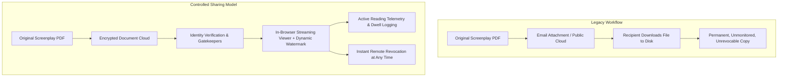
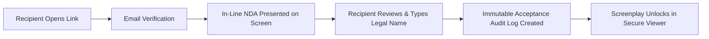
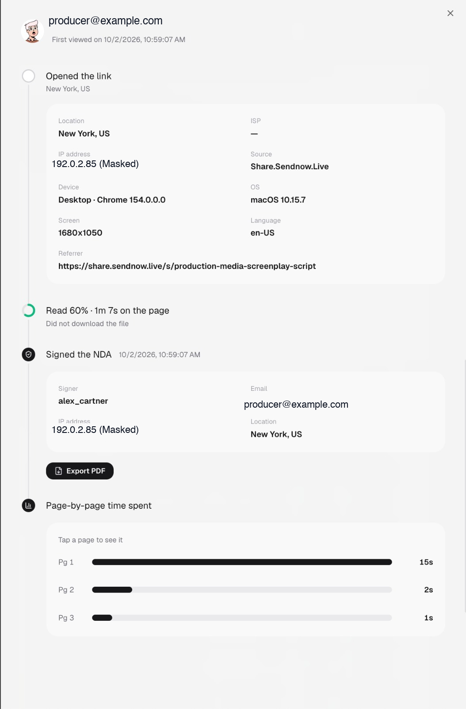
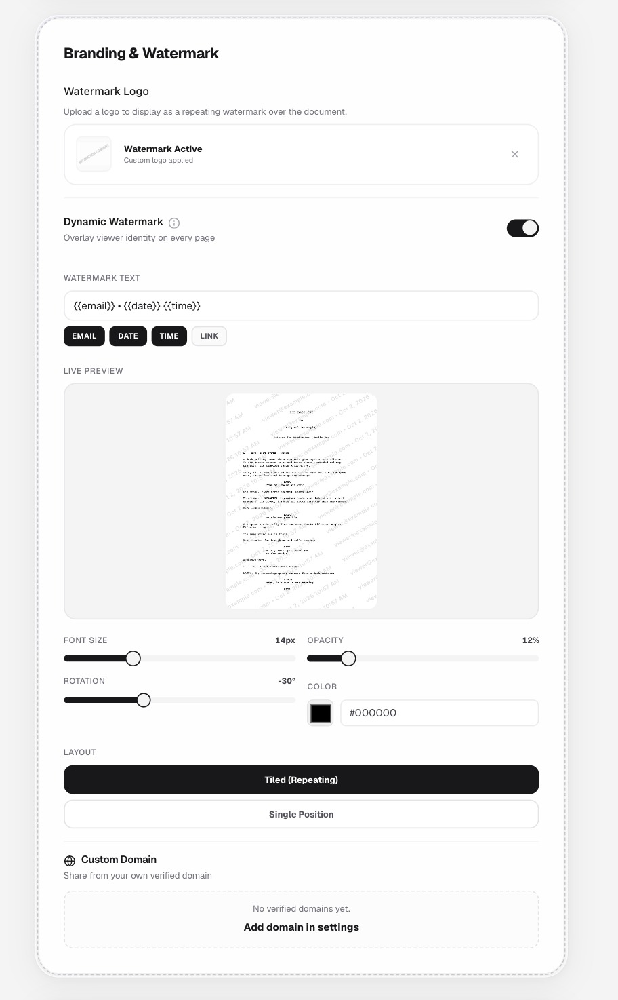
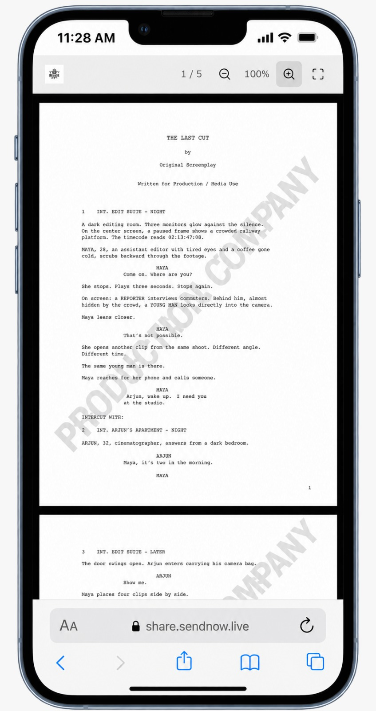
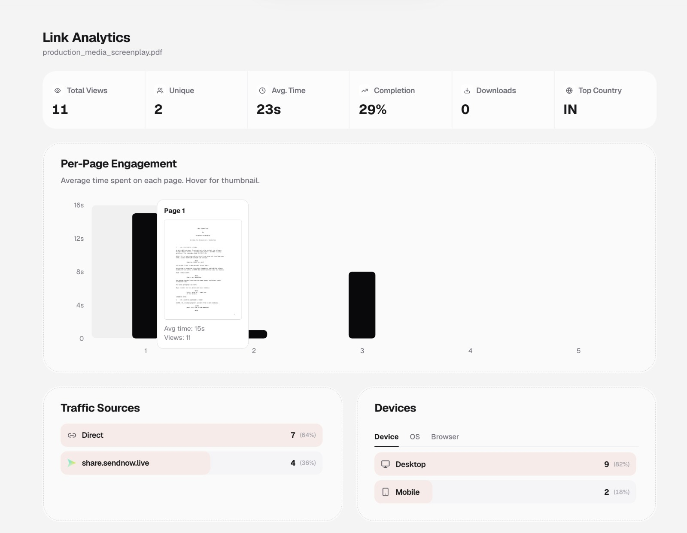
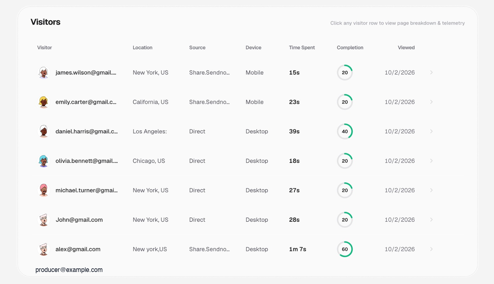

# Screenplay Security Guide: Protect, Share and Monitor Confidential Scripts

[](https://creativecommons.org/licenses/by/4.0/)
[](./guides/)
[](./examples/)
[](./guides/screenplay-security-checklist.md)

An open-source practical guide and architectural reference for screenwriters, filmmakers, directors, producers, and entertainment production teams.

- **WHAT**: A practical technical and procedural resource on protecting, sharing, and monitoring confidential screenplay PDFs.
- **WHO**: Screenwriters, indie filmmakers, studio executives, entertainment attorneys, and production coordinators.
- **WHY**: To eliminate uncontrolled script distribution, deter leaks, and establish clear reader accountability without disrupting professional review timelines.

---

## Table of Contents

- [Why Screenplay Files Need Controlled Sharing](#why-screenplay-files-need-controlled-sharing)
- [Common Screenplay-Sharing Risks](#common-screenplay-sharing-risks)
- [A Safer Sharing Model: File Custody vs. Streaming Access](#a-safer-sharing-model-file-custody-vs-streaming-access)
- [Access Control Options](#access-control-options)
- [NDA-Based Access](#nda-based-access)
- [Password Protection](#password-protection)
- [Download Restrictions](#download-restrictions)
- [Watermarking and Viewer Identification](#watermarking-and-viewer-identification)
- [Sharing with Producers, Actors, and Collaborators](#sharing-with-producers-actors-and-collaborators)
- [Understanding Reader Engagement](#understanding-reader-engagement)
- [Example Secure Screenplay Workflow](#example-secure-screenplay-workflow)
- [Frequently Asked Questions](#frequently-asked-questions)
- [Security Limitations & Threat Realities](#security-limitations--threat-realities)
- [Repository Structure & Guides](#repository-structure--guides)
- [Example Implementation with SendNow](#example-implementation-with-sendnow)
- [Contributing](#contributing)
- [License](#license)

---

## Why Screenplay Files Need Controlled Sharing

In the entertainment industry, an unreleased screenplay represents an entire creative endeavor before public knowledge exists. It contains:

- Proprietary narrative premises, character bibles, and story arcs
- Third-act revelations, plot twists, and climax beats
- Confidentially attached talent and packaging details
- Production location breakdowns, budget assumptions, and sequence schedules

Yet despite the immense financial and reputational stakes riding on script confidentiality, screenplays are routinely distributed as raw PDF attachments or open cloud-storage links. Once a static PDF leaves your custody, control ends permanently. It can be forwarded across agencies, copied onto unmonitored hard drives, or uploaded to unauthorized online repositories.

A modern screenplay workflow replaces uncontrolled file distribution with **controlled, observable document access**.

---

## Common Screenplay-Sharing Risks

Distributing screenplays through traditional email attachments or public drive shares introduces critical vulnerabilities:

1. **Uncontrolled Secondary Forwarding**: An email attachment sent to a producer can be forwarded to assistants, co-financiers, or outside friends without sender awareness.
2. **Permanent Unrevocable Copies**: When an actor passes on a role or an option period lapses, local downloaded PDFs remain permanently stored on the recipient's personal devices.
3. **Anonymous Leaks**: When an unwatermarked script leaks to trade outlets or social media, production teams have zero forensic markers to identify which copy was compromised.
4. **The Submission "Black Hole"**: Senders cannot tell whether an external collaborator read the entire script, stopped at page five, or never opened the file at all.

---

## A Safer Sharing Model: File Custody vs. Streaming Access

Traditional file transfer conflates **reading a script** with **possessing the raw PDF file**. Controlled document sharing cleanly decouples these concepts:



By streaming page renderings directly within a secure web viewer, the production team controls access rules, presents dynamic visual watermarks, suppresses direct file downloads, and measures engagement in real time.

---

## Access Control Options

Before distributing a screenplay link, configure access requirements to match the confidentiality tier of the draft:


*Figure 1: Configurable access controls including email verification, password challenge, in-line NDA agreement, whitelist filtering, and screenshot suppression.*

### 1. Email Verification
Requires reviewers to enter and verify their email address before page content is decrypted. This replaces anonymous link hits with identified viewing sessions.

### 2. Recipient Whitelisting
Restricts document access strictly to a designated list of authorized emails (or entire studio/agency domains). Any outside visitor attempting to load the link is turned away.

### 3. Screenshot Blocker
Deploys browser-level mitigations against casual capture, context-menu saving, print shortcuts, and window blur capture.

---

## NDA-Based Access

Before reading an unproduced script, entertainment legal standards frequently demand a Non-Disclosure Agreement (NDA). Traditional paper or DocuSign workflows introduce weeks of bureaucratic delay.

An **in-line NDA gate** solves this by embedding confidentiality acknowledgement directly into the access sequence:




*Figure 2: Comprehensive audit record capturing recipient name, verified email, masked IP address, timestamp, and signed NDA status.*

- **Zero Reading Delay**: Reviewers can review terms and accept in under 30 seconds.
- **Defensible Audit Trail**: Records exact UTC timestamp, verified email, IP hash, browser user agent, and document version.

For deep-dive implementation guidance, see [NDA Access for Screenplays](./guides/nda-access-for-screenplays.md).

---

## Password Protection

For high-profile projects, pairing an email gate with an independent document password provides essential multi-factor security.


*Figure 3: Dedicated password challenge screen decoupling the link URL from the access credential.*

- **Out-of-Band Delivery**: Send the document URL via email, but provide the unlock code via an alternate channel (SMS, Signal, or phone call).
- **Protection Against Forwarding**: Even if an email thread is inadvertently forwarded, unauthorized recipients cannot open the payload without the out-of-band password.

---

## Download Restrictions

When an external creative partner or talent representative requests a script review, they require **reading access**, not permanent file ownership.

- **Toggle Downloads Off**: Keeps the original PDF file inside the controlled viewing environment.
- **Canvas Streaming**: Screenplay pages are rendered dynamically on an HTML5 canvas rather than served as a raw binary PDF download.
- **Cache Protection**: Discourages automated scraping from local browser temporary folders.

---

## Watermarking and Viewer Identification

Static watermarks (such as a generic `CONFIDENTIAL` stamp) fail to deter leaks because they provide zero attribution. **Dynamic watermarks** automatically generate personalized, session-specific identification across every page in real time.


*Figure 4: Dynamic watermark configuration interface supporting variables like email, date, time, and custom rotation geometry.*

### Dynamic Variable Interpolation
Configure the watermark string to inject viewer context dynamically:

```text
{{email}} • {{date}} {{time}}
```

- Renders as: `producer@example.com • Oct 2, 2026 10:57 AM`
- **Tiled Repeating Pattern**: Spreads diagonally across scene headings, action descriptions, and dialogue blocks at a calibrated angle (-30° or -45°).
- **Subtle Opacity (10%–14%)**: Maintains effortless readability for Courier 12pt screenplay typography while ensuring the watermark remains prominent in any captured photograph or screenshot.


*Figure 5: Mobile viewer displaying fictional sample screenplay "THE LAST CUT" with continuous diagonal watermark coverage.*

For configuration rules and typography guidelines, see [Screenplay Watermarking Guide](./guides/screenplay-watermarking.md).

---

## Sharing with Producers, Actors, and Collaborators

Different creative relationships require calibrated security postures:

| Recipient Role | Objective | Recommended Security Posture | Review Duration |
|---|---|---|---|
| **Studio Executive / Financier** | Packaging evaluation, commercial packaging | Email gate, SMS password, disabled downloads, dynamic watermark | 60–90+ minutes |
| **A-List Talent / Agent** | Role attachment, character review | Whitelist filter, in-line NDA gate, disabled downloads, dynamic watermark | 30–60 minutes |
| **Director / Key Crew** | Pre-production breakdown, shot planning | Email verification, watermarking, custom expiration date | Multi-session re-reads |
| **Casting / Auditions** | Specific scene read | Excerpted sides only (not full draft), strict email gate, 48-hour expiration | 5–15 minutes |

For detailed operational strategies, see [Controlled Script Sharing](./guides/controlled-script-sharing.md).

---

## Understanding Reader Engagement

The traditional document submission process is plagued by false positives: an email client reports an "open," but you have no idea whether the producer actually read the material.

Modern document analytics provide granular visibility into reading velocity, completion rates, and page dwell times.


*Figure 6: High-level link analytics overview tracking views, unique readers, average dwell time, and per-page engagement curves.*

### 1. Document-Level Indicators
- **Unique Viewers vs. Total Views**: Distinguishes between multiple readers and one reader revisiting the script repeatedly.
- **Average Reading Time**: Feature screenplays take 75–110 minutes to read completely. Average dwell times under 3 minutes indicate early abandonment.
- **Completion Rate**: Measures the percentage of pages scrolled into active view.

### 2. The Per-Page Dwell Curve (The "First 10 Pages")
Industry readers famously evaluate screenplays based on the opening sequence. Page-by-page analytics pinpoint exactly where readers engage or drop off:

- **Hook Retention (Pages 1–10)**: High, consistent dwell times (45–70s per page) confirm the opening hooked the reader.
- **Drop-Off Cliff**: A sudden collapse in dwell time at page 4 or page 12 reveals pacing obstacles or loss of reader interest.
- **Skim Detection**: Uniform 3-second dwell times across dozens of pages indicate rapid skimming rather than deep reading.


*Figure 7: Visitor audit table identifying individual reviewer activity across desktop and mobile devices.*

For analytical frameworks, see [Screenplay Reader Analytics](./guides/screenplay-reader-analytics.md).

---

## Example Secure Screenplay Workflow

A standard production workflow moves through five sequential phases:

```mermaid
sequenceDiagram
    autonumber
    actor Writer as Production Office / Writer
    participant Platform as Secure Sharing Platform
    actor Producer as Producer / Reviewer

    Writer->>Platform: Upload sanitized screenplay PDF
    Writer->>Platform: Configure Email Whitelist & Password
    Writer->>Platform: Enable In-Line NDA & Dynamic Watermark
    Writer->>Platform: Generate unique link with 14-day expiration
    Writer->>Producer: Deliver link via email; Deliver password via SMS

    Producer->>Platform: Open link & verify email
    Producer->>Platform: Enter out-of-band password
    Producer->>Platform: Review and execute in-line NDA
    Platform-->>Producer: Stream watermarked screenplay in secure viewer

    Platform->>Writer: Log active dwell time, completion %, and signed NDA
```

1. **Upload & Sanitize**: Export a clean PDF free of author personal contact details and software revision metadata.
2. **Access Gating**: Configure verified email entry, an out-of-band password, and disable direct downloads.
3. **Attribution & Legal Gates**: Activate an in-line NDA gate and dynamic tiled watermark (`{{email}} • {{date}} {{time}}`).
4. **Distribution**: Issue dedicated, recipient-specific link slugs with standard review expiration windows.
5. **Auditing & Revocation**: Monitor reading engagement to guide creative follow-ups; instantly revoke access if negotiations terminate.

---

## Frequently Asked Questions

### How should an unreleased screenplay be shared with a producer?
Instead of attaching a raw PDF to an email, upload the script to a controlled document sharing environment. Generate an individual secure link with email identification, disabled downloads, and dynamic watermarking. Transmit the link via email and provide the password out-of-band (via SMS or phone call).

### Should a screenplay PDF be password protected?
Yes, for external submissions. Adding a password ensures that even if an email containing the link is forwarded, unauthorized recipients cannot view the script without the secondary credential.

### Can an NDA be required before someone views a script?
Yes. Modern document platforms feature in-line NDA gates. The recipient must review the confidentiality terms and submit their signature before any script pages decrypt and render.

### What information can be added to a screenplay watermark?
Dynamic watermarks support programmatic variables including the recipient's verified email address, the access date, exact timestamp, and document link. Production company logos can also be displayed concurrently.

### Can screenplay downloads be disabled?
Yes. In a controlled document viewer, the download toggle can be switched off. Screenplay pages stream dynamically within the browser canvas, preventing direct saving of the underlying binary PDF.

### What can screenplay viewing analytics actually tell you?
Analytics provide total viewing duration, completion percentage, device type, geographic origin, and page-by-page dwell times. This distinguishes a 5-second bounce from a thorough, multi-hour read.

### How can different script recipients be tracked separately?
By generating dedicated individual links for each recipient (or requiring email authentication on a shared link), telemetry records reading activity independently for each collaborator.

### What are the limitations of screenshot protection?
Browser-based screenshot blocking can suppress common keyboard shortcuts, context menus, and screen recording utilities. However, no software can prevent a user from physically photographing their computer screen with an external smartphone. Dynamic watermarks provide the essential defense by ensuring that any captured photograph permanently identifies the viewer.

---

## Security Limitations & Threat Realities

A credible security strategy must be grounded in realistic technical boundaries:

- **Watermarks Deter, They Do Not Encrypt Eyes**: Watermarks create psychological and forensic deterrence; they do not render text invisible.
- **Client-Side Rendering Limits**: Content displayed on a user's monitor must be decoded in local memory.
- **Physical Photography**: Any document readable by human eyes can be photographed by an external camera. Layered defense (verification + NDA + watermark + analytics) maximizes accountability.

---

## Repository Structure & Guides

```text
/
├── README.md                              # Main guide and overview
├── LICENSE                                # CC BY 4.0, CC BY-NC-ND, and MIT terms
├── CONTRIBUTING.md                         # Contribution and style guidelines
├── CITATION.cff                           # Formal academic / industry citation
├── SECURITY.md                            # Threat boundaries and disclosure policy
│
├── guides/
│   ├── protecting-screenplay-pdfs.md      # Converting static PDFs to secure portals
│   ├── controlled-script-sharing.md       # Persona-based sharing workflows
│   ├── nda-access-for-screenplays.md      # In-line confidentiality agreement gating
│   ├── screenplay-watermarking.md         # Dynamic watermark design and tuning
│   ├── screenplay-reader-analytics.md     # Interpreting dwell time and completion
│   └── screenplay-security-checklist.md   # Pre-flight submission verification checklist
│
├── docs/
│   ├── index.md                           # Documentation overview and threat model
│   ├── screenplay-access-control.md       # Technical authentication specifications
│   ├── screenplay-document-security.md    # Canvas rendering and leak mitigation
│   └── screenplay-engagement-tracking.md  # Telemetry pipelines and analytics
│
├── examples/
│   ├── README.md                          # Testing protocol for sample files
│   └── sample-screenplay.pdf              # Fictional demonstration script ("THE LAST CUT")
│
└── screenshots/                           # High-resolution, sanitized workflow images
    ├── screenplay-upload-workflow.png
    ├── screenplay-access-controls.png
    ├── screenplay-dynamic-watermark.png
    ├── screenplay-viewer-identification.png
    ├── screenplay-password-access.png
    ├── screenplay-secure-viewer.png
    ├── screenplay-document-analytics.png
    ├── screenplay-reader-activity.png
    └── screenplay-page-engagement.png
```

---

## Example Implementation with SendNow

The operational screenshots and interface workflows featured throughout this guide are demonstrated using [SendNow](https://sendnow.live/). 

SendNow is a secure document sharing and viewer engagement platform that implements:
- Instant PDF upload and custom link generation
- Multi-tier access gating (Email verification, Whitelisting, Passwords)
- In-line Non-Disclosure Agreement (NDA) gates with exportable execution certificates
- Real-time dynamic visual watermarking (`{{email}}`, `{{date}}`, `{{time}}`)
- Browser-based canvas viewing with direct download suppression
- Page-by-page reader telemetry and engagement drop-off tracking

For more information on SendNow's document security features, visit [sendnow.live](https://sendnow.live/).

---

## Contributing

We welcome contributions from screenwriters, entertainment attorneys, production coordinators, and document security engineers. Please read [CONTRIBUTING.md](CONTRIBUTING.md) for details on submitting improvements, technical corrections, and additional production workflows.

---

## License

This repository uses a multi-part licensing structure:
- **Educational Documentation & Guides**: Licensed under [Creative Commons Attribution 4.0 International (CC BY 4.0)](https://creativecommons.org/licenses/by/4.0/).
- **Fictional Demonstration Screenplay (`THE LAST CUT`)**: Licensed under [Creative Commons Attribution-NonCommercial-NoDerivatives 4.0 International (CC BY-NC-ND 4.0)](https://creativecommons.org/licenses/by-nc-nd/4.0/).
- **Code Snippets & Scripts**: Licensed under the [MIT License](LICENSE).
- **Screenshots & Trademarks**: Product interfaces and marks remain the property of [SendNow](https://sendnow.live/) and are used for educational reference.

See [LICENSE](LICENSE) for complete terms.
