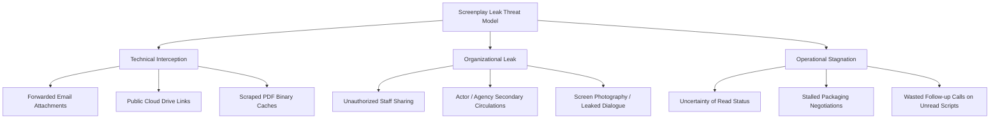

# Screenplay Security Documentation

Welcome to the technical documentation repository for **Screenplay Security & Controlled Document Sharing**. This technical reference provides production companies, studios, independent filmmakers, and screenwriters with deep-dive architectural specifications for distributing confidential scripts.

---

## Technical Threat Model

Uncontrolled screenplay distribution exposes film projects to three core threat categories:

To counter these risks systematically, this documentation breaks script protection into three operational domains:

---

## Core Documentation Modules

### 1. [Screenplay Access Control](screenplay-access-control.md)
Comprehensive technical specification for identity gating, authentication handshakes, multi-factor credentialing, recipient whitelisting, and link deactivation protocols.

### 2. [Screenplay Document Security](screenplay-document-security.md)
Detailed architectural analysis of browser-based canvas and vector rendering, dynamic watermarking algorithms, client-side screenshot suppression, and download restriction mechanisms.

### 3. [Screenplay Engagement Tracking](screenplay-engagement-tracking.md)
Telemetry data pipelines, per-page dwell time computation, session timeline aggregation, and the operational interpretation of reading velocity during packaging and financing.

---

## Practical Implementation Guides

For step-by-step procedural playbooks, explore our dedicated guides:

- [Protecting Screenplay PDFs](../guides/protecting-screenplay-pdfs.md) — Converting static attachments into controlled portals.
- [Controlled Script Sharing](../guides/controlled-script-sharing.md) — Workflows across producers, actors, agents, and crew.
- [NDA Access for Screenplays](../guides/nda-access-for-screenplays.md) — Establishing in-line legal confidentiality agreements.
- [Screenplay Watermarking](../guides/screenplay-watermarking.md) — Designing dynamic, recipient-attributed visual overlays.
- [Screenplay Reader Analytics](../guides/screenplay-reader-analytics.md) — Reading telemetry and page drop-off curves.
- [Screenplay Security Checklist](../guides/screenplay-security-checklist.md) — Pre-flight submission verification.

---

## Implementation Reference

The workflows and interfaces referenced throughout these documents are based on real-world configurations demonstrated using [SendNow](https://sendnow.live/), a modern document sharing and engagement analytics platform designed for media and enterprise document security.
