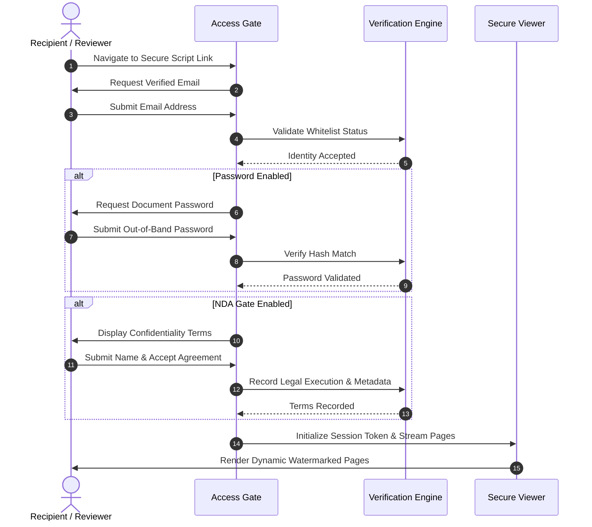

# Screenplay Access Control: Architecture and Verification Protocols

In confidential film and television workflows, **access control** serves as the initial perimeter defense. It determines who may request document pages, validates their identity against production authorizations, and enforces credential barriers before any script content is rendered.

This document provides a technical specification for implementing multi-stage access gating for screenplay distribution.

---

## The Gating Sequence

A robust access control architecture chains verification checkpoints sequentially:

---

## 1. Identity Verification Layer

The first layer requires the reader to identify themselves before gaining access to the script payload.

*Figure 1: Recipient email challenge interface deployed prior to document decryption.*

### Verification Mechanics

- **Session Binding**: The submitted email address is linked to the browser session ID and stored with cryptographic continuity across all subsequent page views.
- **Whitelist Enforcement**: If active, the system checks whether `user@domain.com` matches an explicit list of authorized reviewers. If the address is unauthorized, the gate halts execution and alerts the sender.
- **Organizational Domain Restrictions**: Beyond single-user whitelists, production offices can whitelist an entire agency or studio domain (e.g., `@caa.com`, `@wmeagency.com`, `@sonypictures.com`) to allow internal circulation among designated creative executives.

---

## 2. Decoupled Credentialing (Password Protection)

Even if an authenticated email is submitted, a secondary password barrier prevents unauthorized access if a link is opened by unintended parties.

*Figure 2: Dedicated password verification modal protecting the document payload.*

### Security Principles for Screenplay Passwords

1. **Separation of Transmission Channels**: Distribute the link URL via standard email, but deliver the unlock code via phone, SMS, Signal, or WhatsApp. A compromised inbox alone will not compromise the script.
2. **Per-Recipient Entropy**: Avoid using the production company name or movie title as the password. Generate unique alpha-numeric strings for each major distribution tier.
3. **No Credential Caching Across Documents**: Passwords used for early pitch treatments should never be reused for production drafts or shooting scripts.

---

## 3. Link Lifecycle Management and Revocation

Static file attachments cannot be recalled. Controlled document links, by contrast, feature active lifecycle management:

*Figure 3: Link management settings allowing instantaneous toggle of access parameters and live status.*

### Operational Controls

- **Custom Link Slugs**: Human-readable link slugs (e.g., `/s/last-cut-paramount-pitch`) improve professional presentation while isolating partner traffic into independent reporting containers.
- **Time-To-Live (TTL) Expiration**: Configure automated deactivation dates. For weekend reads, set links to expire Monday at 9:00 AM local time.
- **Instant Kill Switch**: If a deal terminates or negotiations break down, toggle the link to inactive. All subsequent requests immediately fail with an access-revoked response.

---

## Related Documentation

- [Screenplay Document Security](screenplay-document-security.md) — Canvas rendering, watermarking, and download suppression.
- [Screenplay Engagement Tracking](screenplay-engagement-tracking.md) — Real-time telemetry and reading analytics.
- [Controlled Script Sharing Guide](../guides/controlled-script-sharing.md) — Strategic role-based workflows.
