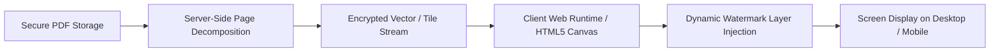

# Screenplay Document Security: Rendering Pipelines and Leak Mitigation

Once a reviewer satisfies all access control requirements, the document security layer governs how screenplay content is decoded, rendered, and displayed on the client device.

This document examines the client-side architecture required to display high-fidelity screenplay typography while minimizing the risk of unauthorized exfiltration.

---

## 1. Streaming Canvas Rendering vs. Raw Binary PDF Delivery

Standard web browsers handle raw PDF links by downloading the entire binary file into local temporary cache and displaying it through native browser PDF plugins (e.g., Chrome PDF Viewer).

### The Inherent Vulnerabilities of Native Browser PDF Viewers

1. **Exposed Save/Print Hooks**: Native viewers display persistent download icons, print triggers, and local caching menus.
2. **Accessible File Binaries**: The full unencrypted PDF is readily extractable from browser cache directories or network developer tools.
3. **No Dynamic Visual Protection**: Native PDF viewers cannot dynamically inject recipient-specific watermarks at runtime without permanently altering the underlying server file.

### The Controlled Rendering Architecture

To overcome native viewer vulnerabilities, modern document platforms (such as [SendNow](https://sendnow.live/)) utilize a streaming canvas rendering pipeline:

- **Server-Side Rasterization / Vector Tiling**: Pages are streamed as individual encrypted tiles or vector instructions rather than a single monolithic file.
- **HTML5 Canvas Presentation**: The document is rendered onto an HTML5 `<canvas>` element. Text cannot be casually highlighted and bulk-scraped using simple browser drag-and-drop.
- **Suppressed Direct Download**: No direct HTTP link to the raw `.pdf` binary is exposed in client-facing HTML or DOM elements.

---

## 2. Dynamic Watermark Interpolation and Geometry

A core requirement of screenplay security is visual accountability. If a page is captured via an external camera or unauthorized screenshot, the image must unambiguously identify the recipient.

*Figure 1: Programmatic watermark generator supporting variable interpolation and live preview.*

### Watermarking Pipeline Mechanics

1. **Variable Resolution**: On every render pass, dynamic variables are resolved using session parameters:
   - `{{email}}` → `producer@example.com`
   - `{{date}}` → `Oct 2, 2026`
   - `{{time}}` → `10:57 AM`
2. **Matrix Transformation**: The text string is translated to canvas coordinates, rotated at a diagonal angle ($\theta = -30^\circ$ or $-45^\circ$), and drawn at a specified opacity ($\alpha = 0.12$).
3. **Tiled Geometry**: The transform repeats across a 2D coordinate grid $(x_i, y_j)$ with equal horizontal and vertical spacing. This guarantees that regardless of how an image is cropped, the viewer's identity remains visible.

*Figure 2: Fictional demonstration screenplay "THE LAST CUT" rendered on mobile with continuous diagonal watermark coverage.*

---

## 3. Client-Side Screenshot Deterrence and Limitations

Document security platforms implement multi-layered deterrents against digital capture:

### Active Mitigation Techniques

- **Print Media Overrides**: CSS `@media print` directives set `display: none !important` across the entire document container, rendering any browser print command as blank white pages.
- **Context Menu Suppression**: Right-click context menus (`contextmenu` event) are suppressed to prevent "Save Image As" actions on individual page canvases.
- **Focus & Visibility API Obfuscation**: When the browser window loses focus (`visibilitychange` or `blur` event), the canvas can be instantly cleared or blurred with a CSS backdrop filter, suppressing background screen recording utilities.

### Technical Boundaries and Honest Threat Modeling

No browser-based software can override the host operating system or defeat hardware capture:

| Capture Threat | Technical Reality | Effective Countermeasure |
|---|---|---|
| **OS-Level Snipping Tool** | Browser cannot always detect external OS-level snip events. | Dynamic tiled watermark permanently tags any captured area with the user's email. |
| **HDMI / Hardware Capture Card** | Hardware grabbers record video output directly from the GPU. | Dynamic tiled watermark remains embedded in the GPU framebuffer signal. |
| **External Smartphone Camera** | Completely outside the software ecosystem. | Dynamic tiled watermark identifies the viewer when photos are posted online. |

Because physical photography remains possible, visual traceability (watermarking) combined with legal deterrence (in-line NDAs) represents the industry standard defense.

---

## Related Documentation

- [Screenplay Access Control](screenplay-access-control.md) — Authentication and gating protocols.
- [Screenplay Engagement Tracking](screenplay-engagement-tracking.md) — Telemetry analysis and per-page metrics.
- [Screenplay Watermarking Guide](../guides/screenplay-watermarking.md) — Production-ready watermarking tips.
