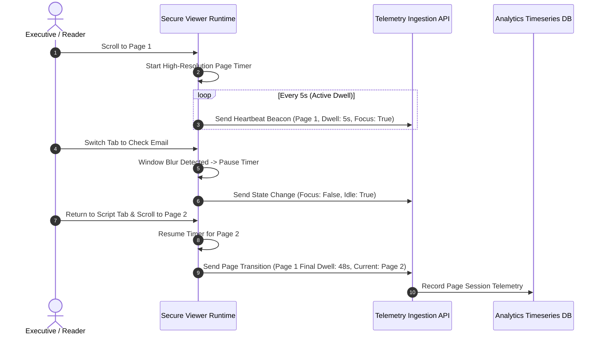

# Screenplay Engagement Tracking: Telemetry Pipelines and Reader Metrics

Document telemetry transforms screenplay distribution from an unmonitored blind spot into an observable operational pipeline. In film packaging and development, knowing how a creative partner interacts with a script provides vital strategic clarity.

This document details the telemetry architecture used to capture reading dwell times, detect abandonment, and aggregate engagement data.

---

## 1. The Client-Side Telemetry Pipeline

Measuring screenplay reading dynamics requires continuous client-side observation without degrading viewport rendering performance.



### Telemetry Hygiene Mechanisms

1. **Focus & Visibility Gating**: If a reader switches tabs or minimizes their browser window, the `document.hidden` API halts dwell time accumulation. This prevents an idle background tab from falsely recording an eight-hour "deep read."
2. **Idle Decay Thresholds**: If no mouse movement, touch gestures, or scroll events occur for more than 120 seconds, the session pauses active dwell logging.
3. **Heartbeat Beaconing**: Telemetry payloads are dispatched asynchronously via the browser's `navigator.sendBeacon()` or lightweight WebSocket channels, guaranteeing delivery even if the reviewer abruptly closes their laptop lid.

---

## 2. High-Level Performance Indicators

High-level metrics provide executive summaries of overall interest across a distribution campaign:


*Figure 1: Document performance dashboard summarizing views, reading completion, and per-page dwell times.*

### Key Telemetry Dimensions

- **Total Views**: Raw cumulative count of every viewing session initiated.
- **Unique Viewers**: Distinct authenticated individuals (deduplicated by verified email).
- **Average Reading Time**: Net active dwell duration spent across all pages.
- **Completion Rate**: The percentage of pages successfully rendered and engaged with.
- **Downloads Count**: A definitive audit counter verifying whether any local copies were downloaded.

---

## 3. Structural Analysis: Mapping Dwell Time to Three-Act Structure

Screenplays follow strict structural conventions: approximately one page of formatted script equates to one minute of screen time. Telemetry curves directly reveal how readers respond to narrative milestones:

```text
Feature Screenplay Structure & Dwell Time Curve
Dwell (s)
 70 |  [Act I Hook]                   [Midpoint Twist]              [Climax]
    |      * *                             * *                         * *
 45 |     *   *                           *   *                       *   *
    |    *     *                         *     *                     *     *
 20 |   *       *                       *       *                   *       *
    |  *         * * * * * * * * * * * *         * * * * * * * * * *         *
  0 +-------------------------------------------------------------------------
   Page 1     Page 10      Page 30      Page 60       Page 90     Page 115
   (Hook)   (Coverage    (Act I Break) (Midpoint)    (Act II End) (Resolution)
             Decision)
```

- **Pages 1–10 (The Hook / Reader Coverage Phase)**: Studio readers and executive assistants frequently determine whether to recommend a script within the first ten pages. Sharp drop-offs here indicate pacing issues or concept mismatch.
- **Pages 25–30 (Plot Point 1)**: Readers who cross this threshold have committed to the core narrative engine.
- **Pages 85–90 (The Dark Night of the Soul / Climax Entry)**: High dwell times here indicate intense reader immersion leading into the final resolution.

---

## 4. Multi-Viewer Auditing and Individual Records

When a script is circulated among multiple co-producers or agents, visitor logs differentiate distinct stakeholder reactions:


*Figure 2: Multi-viewer audit table displaying distinct engagement levels across reviewers.*

### Translating Telemetry into Operational Strategy

- **Executive A (39s total dwell, 40% completion)**: Skimmed the first act, evaluated character names, and closed the window. Suitable for an email follow-up offering an executive summary or treatment.
- **Executive B (1m 7s dwell on 5-page teaser, 60% completion, NDA signed)**: Actively read through key scene work. Highly qualified candidate for a direct creative conversation.

---

## 5. Granular Session Timeline & Forensic Audit Records

Drilling down into an individual session yields an exhaustive audit log:


*Figure 3: Individual session record linking network telemetry, NDA execution, and page-level dwell time.*

### Stored Metadata Elements

- **Client Environment**: Operating system (e.g., `macOS 10.15.7`), browser engine (`Chrome 154.0.0.0`), and screen dimensions (`1680x1050`).
- **Network Metadata**: Anonymized/masked IP address (`192.0.2.85`) and geographic origin (`New York, US`).
- **Legal Record**: Date, exact timestamp, and signer name for in-line NDA execution.
- **Per-Page Breakdown**: Exact seconds recorded on every individual page (e.g., Page 1: 15s, Page 2: 2s, Page 3: 1s).

---

## Related Documentation

- [Screenplay Access Control](screenplay-access-control.md) — Gating mechanisms and identity verification.
- [Screenplay Document Security](screenplay-document-security.md) — Canvas rendering, watermarking, and download suppression.
- [Screenplay Reader Analytics Guide](../guides/screenplay-reader-analytics.md) — Practical interpretation of reader engagement.
