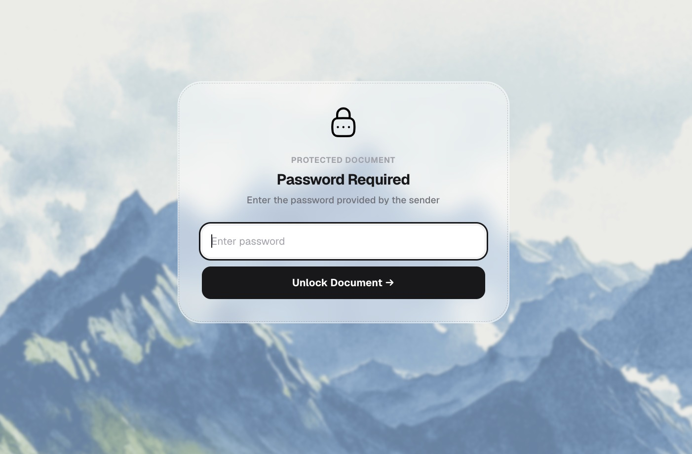

# Controlled Script Sharing: Workflows Across Production Roles

Distributing a screenplay is rarely a one-size-fits-all procedure. During the lifecycle of a film or television project, a script passes through many hands—producers evaluating pitch packaging, directors preparing visual treatments, talent agents considering attachment, and department heads budgeting scene sequences.

Each stakeholder group represents a distinct operational context, review dynamic, and security exposure profile. This guide explores role-based sharing strategies, access credentialing, and access revocation techniques.

---

## The Role-Based Distribution Matrix

Treating every recipient identically creates either excessive friction for key creative partners or dangerous vulnerability for high-value intellectual property. Use this operational matrix to calibrate security controls:

| Recipient Persona | Primary Objective | Recommended Controls | Dwell Time Target |
|---|---|---|---|
| **Executive Producers & Financiers** | Greenlight evaluation, high-level packaging review | Email gating, custom password (via SMS), disabled downloads, full-page dynamic watermark | 45–90+ minutes across complete draft |
| **A-List Talent & Agents** | Talent attachment, role suitability assessment | Pre-screened email whitelist, in-line NDA gate, disabled downloads, recipient-tagged watermark | 30–60 minutes (focused on character scenes) |
| **Director & Key Department Heads** | Breakdown, location scouting, budget prep | Email verification, watermarking, time-bounded access link, enabled or disabled downloads depending on prep phase | Repeated multi-hour sessions across scenes |
| **Casting & Audition Talent** | Reading specific sides or excerpt scenes | Excerpt-only PDF (not full script), strict email gate, watermark, 48-hour automated expiration | 5–15 minutes on assigned scene numbers |

---

## Establishing Recipient Identity at the Access Gate

A secure sharing workflow requires positive identification before any script pages render on screen.

*Figure 1: Recipient email entry gate requiring the reviewer to authenticate their identity before document access is granted.*

### Why Identification Precedes Viewing

1. **Elimination of Anonymous URLs**: When links can be viewed anonymously, a leaked URL provides zero attribution. Requiring an email address forces the reviewer to identify the session under their professional identity.
2. **Deterministic Telemetry Attribution**: An open count of "15 views" is meaningless if you cannot tell whether one assistant opened the script 15 times or 15 different department heads reviewed it. Identified sessions map reading metrics to specific individuals.
3. **Whitelist Validation**: In restricted environments, the portal checks the entered address against an authorized whitelist. If an executive forwards the link to an outside associate, that associate will be blocked unless explicitly whitelisted by the production team.

---

## Separating Link Distribution from Access Credentials

Even with email verification, sharing sensitive materials requires defense in depth. If an email thread containing a secure link is accidentally CC'd or forwarded, a secondary barrier prevents immediate exposure.

*Figure 2: Secondary password gate ensuring the link URL and document unlock credential remain decoupled.*

### Best Practices for Credential Handling

- **Dual-Channel Distribution**: Send the document URL via email or production software, but communicate the unlock password via a secondary channel (such as a secure text message, Signal, or a phone conversation).
- **Unique Passwords per Recipient Tier**: Rather than setting a single universal password like `Production2026!`, generate unique passwords for each tier (or generate separate recipient-specific links). This isolates compromised credentials immediately.
- **Avoid Embedding Passwords in Email Subject Lines**: Common email search indexing compromises credentials when passwords are placed in the subject or preview snippet.

---

## Multi-Recipient Links vs. Dedicated Recipient Links

When distributing a screenplay to multiple potential co-producers or agents, production teams must choose between two delivery architectures:

### Approach A: One Master Link with Email Gating
- **How It Works**: A single secure link is generated with email verification enabled and shared with 10 recipients.
- **Advantages**: Easy link generation and single-dashboard oversight.
- **Tradeoffs**: If you need to revoke access for one recipient who passed on the project, revoking the master link revokes access for everyone.

### Approach B: Dedicated Individual Links (Recommended for High Stakes)
- **How It Works**: A distinct link slug is created for each recipient (e.g., `/s/last-cut-warner-exec`, `/s/last-cut-talent-rep`).
- **Advantages**:
  - Independent access revocation: If one negotiation closes or terminates, that specific link is killed without disrupting other reviewers.
  - Distinct security rules: You can enforce an NDA on an external investor's link while granting direct password-only access to a long-time co-producer.
  - Granular telemetry isolation: Metrics remain completely segregated by partner.

---

## Expiration and Revocation Protocols

Unmonitored, evergreen links are one of the most common vectors for legacy screenplay leaks. Months after an actor passes on a role or an option expires, active links remain accessible on personal devices.

### Operational Revocation Guidelines

1. **Standard Review Windows**: Set an upfront expiration window (typically 7 to 14 days) for unsolicited or introductory reads. Inform the recipient's representative: *"This link is active through next Friday for review."*
2. **Instant Kill Switches**: If creative relationships sour or an actor declines, immediately deactivate the link from your document management dashboard. Any subsequent attempt to open the URL returns an access denied state.
3. **Draft Archival**: When a new script revision is finalized (e.g., transitioning from Yellow Draft to Green Draft), retire previous links so collaborators do not continue reading deprecated scene numbers or discarded dialogue.

---

## Related Reading

- [Protecting Screenplay PDFs](protecting-screenplay-pdfs.md) — Technical fundamentals of browser-rendered document security.
- [NDA Access for Screenplays](nda-access-for-screenplays.md) — Placing enforceable non-disclosure agreements before script viewing.
- [Screenplay Reader Analytics](screenplay-reader-analytics.md) — Interpreting page-by-page dwell time and reader telemetry.
- [Screenplay Security Checklist](screenplay-security-checklist.md) — Pre-flight distribution verification.
