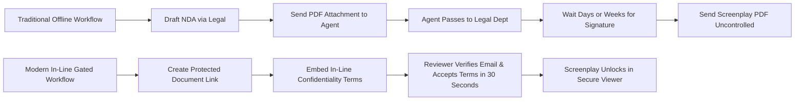

# NDA Access for Screenplays: Implementing In-Line Confidentiality Gates

Before sharing an unproduced screenplay, production companies frequently require recipients to execute a Non-Disclosure Agreement (NDA). In high-budget feature development and prestige television, an unreleased script leak can disrupt financing, compromise casting exclusivity, or spoil critical plot twists.

However, traditional NDA workflows often stall creative momentum. Sending a standalone legal PDF via DocuSign or physical mail introduces bureaucratic friction, leading talent representatives and producers to deprioritize the read.

This guide details how to implement an **in-line NDA gate** that enforces legal confidentiality directly within the document-access sequence without stalling review timelines.

---

## The Operational Dilemma: Friction vs. Protection

Entertainment legal departments and creative executives often find themselves in conflict regarding NDA requirements:

### Why Traditional Workflows Break Down

1. **Review Delays**: High-profile producers and actors receive dozens of scripts weekly. A request to route an NDA through an external agency legal department can delay reading by two to four weeks.
2. **Disconnected Custody**: Even when a paper NDA is signed, the subsequent script delivery is often handled via an ordinary email attachment. The legal agreement exists in one system, while document delivery remains completely unmonitored.
3. **Execution Gaps**: Submissions often proceed without an executed NDA simply because "the meeting is tomorrow morning and legal hasn't cleared the paperwork yet."

---

## How In-Line NDA Gating Operates

An in-line NDA gate embeds legal acknowledgement directly into the viewing session. The document viewer acts as a conditional gatekeeper:

1. **Link Navigation**: The recipient clicks the secure screenplay link.
2. **Identification**: The viewer verifies their email address and enters the document password (if configured).
3. **Agreement Presentation**: Before a single scene heading renders, the recipient is presented with the confidentiality agreement text.
4. **Active Acknowledgement**: The recipient reviews the terms, types their legal name or checks the acknowledgement box, and clicks **Accept Agreement**.
5. **Session Unlocking**: The viewer decodes and displays the watermarked screenplay immediately.

*Figure 1: Activating the in-line NDA / Agreement Gate within the document sharing settings drawer.*

---

## Elements of an Audit-Ready Digital NDA Record

For an in-line confidentiality agreement to provide genuine legal utility, the document platform must capture an immutable telemetry record at the moment of acceptance.

*Figure 2: Comprehensive session record showing exact timestamp, verified email, signer name, masked IP address, and acceptance state.*

### Essential Data Fields for the Audit Trail

A defensible audit log should record:

- **Signer Identity**: Full name entered by the recipient along with their verified email address.
- **Precise Timestamp**: Standardized UTC timestamp marking the exact second of acceptance.
- **Network Metadata**: IP address (masked for privacy compliance where applicable) and geographic location.
- **Client Fingerprint**: Browser version, operating system, device family, and screen resolution.
- **Document Version Hash**: The cryptographic hash of the specific screenplay draft displayed during acceptance.
- **Exportable PDF Proof**: Capability to download a formal certificate of acceptance with the underlying terms embedded.

---

## Best Practices for Screenplay NDA Terms

When authoring in-line confidentiality terms for screenplay distribution, entertainment attorneys typically focus on five critical clauses:

1. **Strict Non-Disclosure of Story Elements**: Clear prohibition against disclosing premise, character details, dialogue, plot outlines, or ending beats to any third party or press outlet.
2. **Non-Circumvention & Proprietary Rights**: Explicit affirmation that all ideas, characters, and trademarks remain the sole property of the production company or screenwriter.
3. **Prohibition of Digital Redistribution**: Explicit restriction against extracting, re-hosting, screen-capturing, or feeding the text into generative AI training corpora.
4. **Term of Confidentiality**: Typically defined as either a multi-year duration (e.g., 2–5 years) or until the motion picture is commercially released in theaters or on a streaming service.
5. **No Implied Obligation**: Confirmation that receipt and review of the script creates no obligation to enter into a production agreement, option contract, or creative partnership.

---

## Legal Considerations: Enforceability of In-Line Agreements

Courts in major entertainment jurisdictions (including California and New York) routinely evaluate digital agreements under **clickwrap** jurisprudence. To maximize enforceability:

- **Clear Notice**: The agreement text must be prominently displayed before access is granted, not hidden behind an obscure hyperlink.
- **Affirmative Action**: The recipient must be required to take an active affirmative step (clicking a distinct button such as "I Agree & Unlock Screenplay") rather than relying on passive browsewrap assumptions.
- **Record Retention**: The sender must maintain durable records of the agreement version, timestamp, and user identity.

---

## Related Reading

- [Protecting Screenplay PDFs](protecting-screenplay-pdfs.md) — Fundamental document security and access controls.
- [Screenplay Watermarking](screenplay-watermarking.md) — Dynamic attribution for external viewers.
- [Screenplay Reader Analytics](screenplay-reader-analytics.md) — Auditing session engagement after NDA execution.
- [Screenplay Security Checklist](screenplay-security-checklist.md) — Verification protocols prior to sharing.
