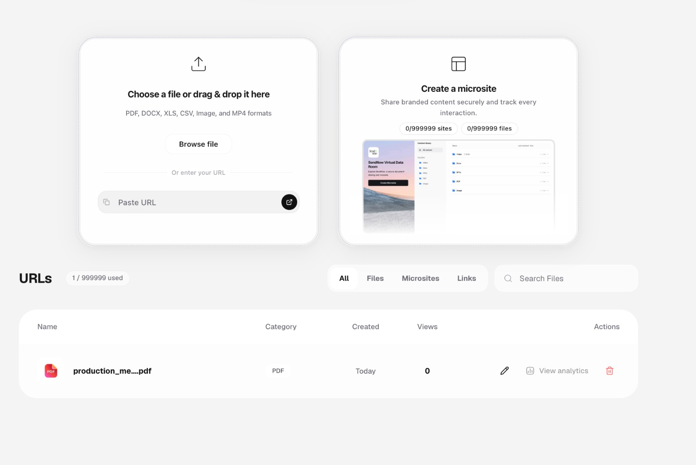
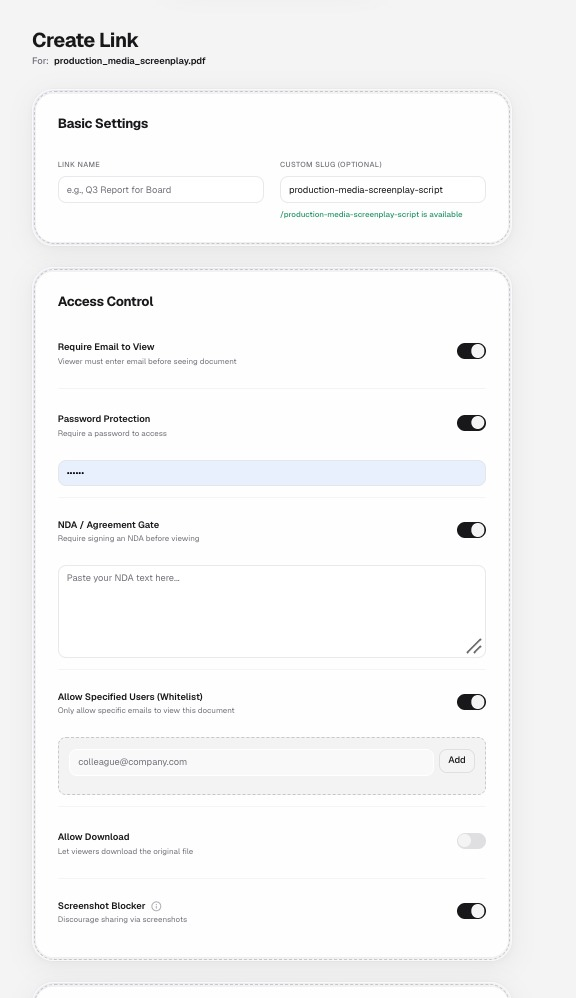

# Protecting Screenplay PDFs: From Static Files to Controlled Viewing

In the film and episodic television industry, an unreleased screenplay represents the foundational intellectual property of an entire production. It contains narrative arcs, character bibles, casting requirements, dialogue beats, and proprietary plot revelations. 

Yet despite millions of dollars riding on script confidentiality, screenplays are routinely distributed using ordinary email attachments or unmonitored cloud storage links. Once a raw PDF file leaves your device, traditional custody ends.

This guide outlines why conventional PDF security falls short in entertainment workflows and details how to establish an active, controlled viewing environment.

---

## The Core Problem with Standard PDF Distribution

Traditional PDF sharing relies on one of three basic approaches, each with severe operational weaknesses:

| Distribution Method | Operational Weakness | Risk Level |
|---|---|---|
| **Direct Email Attachment** | The raw PDF is downloaded to local client storage. It can be forwarded, uploaded to file-sharing networks, or stored on unprotected devices indefinitely. | 🔴 High |
| **Standard Cloud Links (Drive / Dropbox)** | Even with "View Only" flags, recipients can often inspect browser network caches, print to PDF, or distribute the public URL without sender oversight. | 🟠 Medium-High |
| **Native Adobe Acrobat Password** | Standard 128-bit/256-bit owner passwords can be stripped in seconds using free open-source utilities once the recipient possesses the file. | 🔴 High |

When a script is emailed as `The_Last_Cut_Draft_v4.pdf`, the sender cannot answer fundamental security questions:
- *Was the document forwarded to an unauthorized third party?*
- *Did the recipient retain a permanent copy on an unsecured personal laptop?*
- *Was the screenplay actually reviewed, or did it sit unopened in an inbox?*

---

## Transitioning to Controlled In-Browser Viewing

A secure screenplay sharing workflow separates **access to content** from **possession of the underlying file**. Instead of transmitting the file itself, the production team creates an authenticated, browser-rendered viewing portal.

*Figure 1: Uploading a screenplay PDF into a controlled viewing environment where sharing parameters are configured prior to link distribution.*

### Key Architectural Shifts

1. **Streaming Pages vs. File Delivery**:
   Rather than downloading a monolithic 120-page PDF to local disk, the viewer streams vector or rendered raster page assets on demand. The raw binary PDF never sits unencrypted in the user's permanent download directory.
2. **Download Prevention**:
   Disabling the direct download capability ensures that collaborators (e.g., prospective directors, talent agents, financiers) review the material inside a sandboxed session rather than taking ownership of a local file.
3. **Session-Bound Telemetry**:
   Because viewing takes place in an active web runtime, every page transition, dwell duration, and session start can be measured and logged back to the production desk.

---

## Configuring Document-Level Access Controls

Before a single link is distributed to external parties, production managers must enforce access prerequisites tailored to the project's confidentiality tier.

*Figure 2: Fine-grained access control toggles including email verification, document passwords, NDA gates, recipient whitelisting, and screenshot protection.*

### Essential Protection Layers

1. **Email Identification & Verification**:
   Anonymous links invite leak hazards. Requiring a verified email address ensures that every session is tied to an identifiable human collaborator.
2. **Dedicated Document Passwords**:
   By transmitting the document link via one channel (e.g., email) and the password via an out-of-band channel (e.g., encrypted messaging or phone call), intercepted URLs cannot be opened by unauthorized interceptors.
3. **Recipient Whitelisting**:
   For ultra-sensitive projects, links can be restricted strictly to a pre-approved list of email addresses. Anyone attempting access outside the whitelist is rejected at the gate.
4. **Screenshot Deterrence**:
   While client-side controls cannot block an external hardware camera, software-level screenshot blockers suppress browser-level screen capture tools, clipboard transfers, and developer console dumps.

---

## Technical Realities: What Document Protection Can and Cannot Do

A technically responsible security plan never relies on false promises of "unbreakable DRM." Film production teams must evaluate controls realistically:

- **What Controlled Viewing Solves**:
  - Eliminates casual forwarding of raw script files.
  - Prevents automated indexing and unauthorized permanent storage.
  - Creates a definitive audit log of who opened the document, when, and from what device.
  - Couples with dynamic watermarking to deter leaks via visual accountability.
- **What No Technology Can Completely Prevent**:
  - An authorized reader physically pointing an external smartphone at their laptop monitor to photograph a page.
  - An authorized reader taking manual handwritten notes or verbally describing narrative twists.

Because physical monitor photography remains possible, visual deterrence (dynamic watermarking) and legal deterrence (in-line NDA acceptance) must accompany technical access controls.

---

## Next Steps

To build out your production's sharing pipeline, continue with the following guides:
- [Controlled Script Sharing](controlled-script-sharing.md) — Strategies for staging access across producers, talent, and crew.
- [Screenplay Watermarking Guide](screenplay-watermarking.md) — Designing dynamic, recipient-attributed watermarks.
- [NDA Access for Screenplays](nda-access-for-screenplays.md) — Implementing enforceable digital agreement gates before script viewing.
- [Screenplay Security Checklist](screenplay-security-checklist.md) — A step-by-step pre-flight checklist before sending any script.
